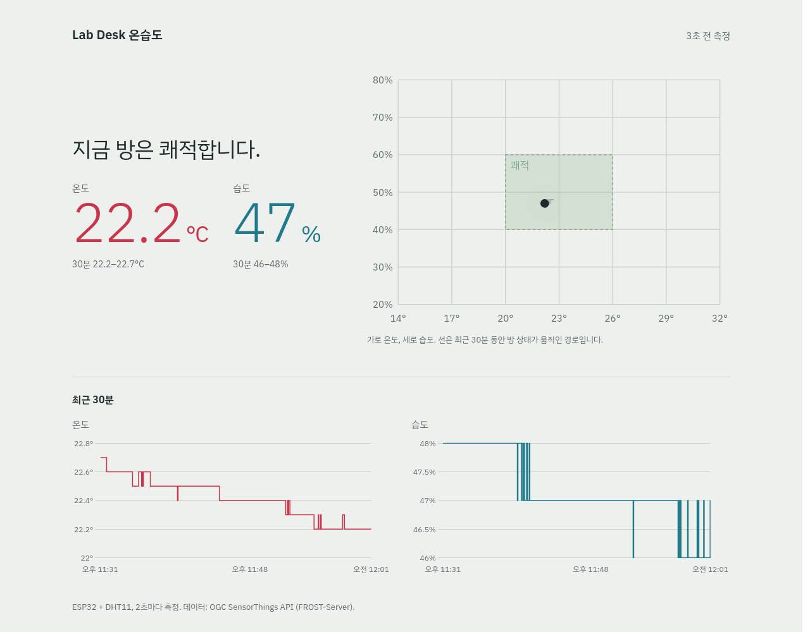

# STA Sensor Dashboard

ESP32 + DHT11로 측정한 온도·습도를 Wi-Fi로 **OGC SensorThings API(STA) 1.1** 서버(FROST-Server)에 저장하고, Next.js 웹에서 실시간으로 보여주는 IoT 모니터링 프로젝트.



## 프로젝트 소개

- ESP32가 DHT11을 2초마다 읽어 값 범위를 검증하고, NTP로 맞춘 UTC 시각을 붙여 STA `Observation`으로 직접 POST한다. 중간 수집 서버가 없다.
- Jetson Orin Nano에서 FROST-Server와 PostgreSQL/PostGIS를 Docker Compose로 실행한다.
- 웹은 STA REST API를 5초마다 조회해 현재 온습도, 쾌적도 차트, 최근 30분 그래프를 그린다.
- 새 측정값은 날짜별 JSON 파일(`~/sta-backups/json/`)에도 실시간으로 쌓인다.

전체 구축 과정은 [sta_iot_dashboard_full_guide_esp.md](sta_iot_dashboard_full_guide_esp.md)에 단계별로 정리되어 있다.

## STA(SensorThings API)란?

**OGC SensorThings API**는 국제 표준화 기구 OGC가 정한 IoT 센서 데이터 표준이다. "어떤 장치의 어떤 센서가 무엇을 언제 얼마로 쟀는가"를 저장하는 데이터 구조와, 그것을 읽고 쓰는 REST API(JSON) 규칙을 함께 정해 둔다.

**왜 쓰나**

- 센서 쪽과 화면 쪽이 서로를 몰라도 된다. 둘 다 STA 규칙대로만 말하면 되므로 DHT11을 다른 센서로 바꾸거나 대시보드를 Grafana 같은 다른 도구로 바꿔도 나머지는 그대로 둔다.
- DB 테이블과 API를 직접 설계하지 않는다. FROST-Server 같은 STA 서버가 저장, 조회, 필터(`$filter`), 정렬(`$orderby`), 개수 제한(`$top`)을 표준 문법으로 제공한다.
- 측정값마다 단위, 센서, 측정 대상 정보가 연결되어 있어 나중에 데이터를 봐도 뜻이 분명하다.

**이 프로젝트에서 STA가 쓰이는 곳**

| 단계 | 파일 | 하는 일 |
|---|---|---|
| STA 서버 | `infra/compose.yaml` | FROST-Server(STA 1.1 구현체)와 PostgreSQL 실행 |
| 데이터 구조 등록 | `infra/create_entities.sh` | Thing, Sensor, ObservedProperty, Datastream 생성 |
| 보내기 | `esp32/dht11_wifi/dht11_wifi.ino` | 측정할 때마다 `POST /Observations` |
| 읽기 (웹) | `web/lib/sta.ts` | `GET /Datastreams(id)/Observations`로 최근 값 조회 |
| 읽기 (JSON 저장) | `infra/stream_json.sh` | 같은 API로 새 측정값을 받아 날짜별 JSON에 추가 |

## 시스템 아키텍처

```text
DHT11 ──▶ ESP32 ── Wi-Fi · HTTP POST /Observations ──▶ FROST-Server (STA 1.1) ──▶ PostgreSQL/PostGIS
                                                             ▲        (Jetson, Docker)
                                                             │ HTTP GET
                                                   Next.js + Chart.js (브라우저)
```

## 기술 스택

| 영역 | 사용 기술 |
|---|---|
| 디바이스 | ESP32 (Arduino core), DHT11, Adafruit DHT 라이브러리 |
| 서버 | FROST-Server 2.8 (`frost-server-http`), PostgreSQL 16 + PostGIS 3, Docker Compose |
| 웹 | Next.js 16, React, TypeScript, Chart.js 4 / react-chartjs-2 |
| 호스트 | NVIDIA Jetson Orin Nano Super (Ubuntu, ARM64) |

## 하드웨어와 배선

ESP32 GPIO는 3.3V 전용이므로 DHT11 VCC는 반드시 `3V3`에 연결한다.

| DHT11 | ESP32 |
|---|---|
| VCC (`+`) | 3V3 |
| DATA (`OUT`/`S`) | GPIO4 |
| GND (`-`) | GND |

## 빠른 시작

```text
esp32/dht11_wifi/   ESP32 스케치 (secrets.h는 직접 생성)
infra/              FROST + PostGIS Compose, STA 엔티티 생성 스크립트
web/                Next.js 대시보드
```

**1. 서버 (Jetson)**

```bash
cd infra
cp .env.example .env          # DB 비밀번호와 JETSON_IP 수정
chmod 600 .env
docker compose up -d --build
curl http://localhost:8080/FROST-Server/v1.1
./create_entities.sh          # Thing/Location/Sensor/ObservedProperty/Datastream 생성 → ids.env
```

**2. ESP32**

`esp32/dht11_wifi/secrets.h.example`을 `secrets.h`로 복사해 Wi-Fi 정보, Jetson IP, `ids.env`의 Datastream ID를 넣고 Arduino IDE로 업로드한다. Wi-Fi는 2.4GHz만 지원한다.

**3. 웹**

```bash
cd web
cp .env.example .env.local    # Datastream ID 수정 (STA 주소는 /sta 프록시 사용)
npm ci
npm run dev -- --hostname 0.0.0.0
```

`http://JETSON_IP:3000`에서 확인한다. 부팅 시 자동 실행하려면 production 빌드 후 systemd user 서비스로 등록한다.

```bash
npm run build
systemctl --user link ~/sta-iot-dashboard/infra/sta-web.service
systemctl --user enable --now sta-web
sudo loginctl enable-linger $USER   # 로그인하지 않아도 부팅 시 시작
```

Node.js 20.9 이상이 필요하다(Node 24 권장). 다른 PC에서 개발 서버에 접속하려면 `.env.local`의 `JETSON_IP`를 설정한다.

## SensorThings API 데이터 모델

```text
Thing (ESP32 Room Sensor) ── Location (Lab Desk)
 ├─ Datastream: Room Temperature ── Sensor(DHT11 Temperature) · ObservedProperty(Air Temperature) · °C
 └─ Datastream: Room Humidity    ── Sensor(DHT11 Humidity) · ObservedProperty(Relative Humidity) · %
       └─ Observation { phenomenonTime(UTC), result }
```

## API 예시

ESP32가 보내는 Observation:

```bash
curl -X POST http://JETSON_IP:8080/FROST-Server/v1.1/Observations \
  -H 'Content-Type: application/json' \
  -d '{"phenomenonTime":"2026-09-27T12:00:00Z","result":24.3,
       "parameters":{"source":"esp32-wifi","timeBasis":"esp32-ntp"},
       "Datastream":{"@iot.id":1}}'
```

최신값 1개 조회:

```bash
curl 'http://JETSON_IP:8080/FROST-Server/v1.1/Datastreams(1)/Observations?$top=1&$orderby=phenomenonTime%20desc&$select=result,phenomenonTime'
```

## 화면

- 상단: 마지막 측정 경과 시간. 15초 이상 새 값이 없거나 장비 시각이 틀리면 원인과 확인할 곳을 표시
- 현재 상태: 쾌적 판정 문장(쾌적 범위 20–26°C, 40–60%), 온도·습도 현재값과 30분 최저–최고
- 쾌적도 차트: 가로 온도 × 세로 습도 평면에 쾌적 구간과 최근 30분 이동 경로, 현재 위치
- 최근 30분 그래프: DHT11 분해능에 맞춘 계단형 선, 라이트/다크 모드 자동 전환

## 테스트 방법

```bash
cd web
npx eslint .
npm run build
```

단계별 점검표(센서 → Wi-Fi → FROST/DB → STA 모델 → 자동 수집 → 웹)는 가이드 14절을 따른다.

## 문제 해결

자주 발생하는 오류(`dht_read_failed`, `ntp_not_synced`, `http:-1`, ARM64 이미지, CORS, 9시간 시차 등)와 해결 방법은 가이드 13·15절에 있다.

## 보안과 제한사항

- 신뢰할 수 있는 로컬 네트워크의 학습용 구성이다. 인터넷에 그대로 공개하지 않는다.
- FROST 쓰기에 인증이 없어 같은 LAN의 누구나 Observation을 POST할 수 있다.
- ESP32 ↔ FROST 구간은 평문 HTTP다.
- `.env`, `.env.local`, `secrets.h`는 Git에서 제외된다. `NEXT_PUBLIC_` 값은 브라우저에 공개되므로 비밀값을 넣지 않는다.
- 2초 간격이면 센서당 하루 43,200개가 쌓인다. 현재는 보존 기간 제한 없이 모두 보관한다.

## 운영

| 항목 | 설정 |
|---|---|
| DB 백업 | `infra/backup.sh` — cron으로 매일 03:00 `~/sta-backups`에 `pg_dump -Fc`, 14일 보관 |
| 실시간 JSON | `infra/stream_json.sh` — systemd user unit `sta-json`이 2초마다 새 측정값을 `~/sta-backups/json/YYYY-MM-DD.json`(한국 날짜) 배열 끝에 추가. 재시작해도 `.last_id`부터 이어 받음 |
| 웹 자동 실행 | `infra/sta-web.service` (systemd user, 실패 시 5초 후 재시작) |
| 원격 접속 | 웹의 `/sta/*`를 Next rewrites로 Jetson 내부 FROST(`localhost:8080`)에 전달 → 3000 포트 하나로 LAN·Tailscale(`http://TAILSCALE_IP:3000`) 모두 접속 |
| 컨테이너 | Compose `restart: unless-stopped` |
| FROST 이미지 | `frost-server-http:2.8.0` = `sha256:3102b01ac2ab664fac277b551f3a625a88ab8d606625d1aeea5309559530f4f0` |

복원 예시:

```bash
cd infra
docker compose exec -T database pg_restore -U sensorthings -d sensorthings --clean < ~/sta-backups/sensorthings-YYYY-MM-DD.dump
```

## 확장 계획

1. ~~현재 구조 안정화~~ — 백업, 웹 자동 실행 완료 (남은 것: Jetson IP DHCP 예약)
2. 추가 센서
3. MQTT
4. 임계값 알림
5. AGV 연동
6. VLM/AI 분석

## 라이선스

미정.
